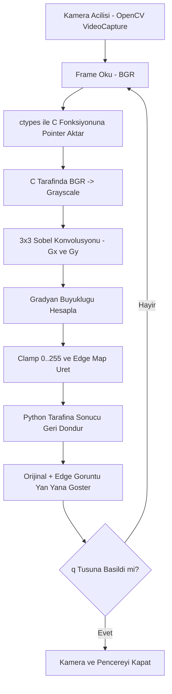

# Hibrit Goruntu Isleme ve Sobel Edge Detection Projesi - Teknik Rapor

GitHub Repo: https://github.com/mustafaemre0/hibrit-goruntu-isleme-edge-detection

## 1. Projenin Amaci ve Tanimi

Bu projenin temel amaci, kamera goruntusu uzerinde gercek zamanli kenar tespiti islemini hibrit bir yazilim mimarisi ile gerceklestirmektir. Projede iki farkli katman birlikte kullanilmistir:

1. Ust seviye katmanda Python ve OpenCV ile kamera erisimi, goruntu akisi ve kullaniciya gosterim islemleri yonetilmistir.
2. Hesaplama yogun katmanda C dili ile Sobel filtresi sifirdan yazilarak pikseller uzerinde dusuk seviyeli islem yapilmistir.

Bu yaklasim sayesinde, bir yandan hizli prototipleme ve kutuphane destegi korunurken diger yandan algoritmanin cekirdegi pointer aritmetigi ve dongulerle daha kontrollu sekilde uygulanmistir. Proje, Python-C etkilesimini ctypes kutuphanesi ile kurarak farkli dillerde yazilan modullerin ayni goruntu hatti icinde birlikte calisabilecegini gostermektedir.

## 2. Sistem Mimarisi ve Akis Diyagrami

Sistem iki ana bilesenden olusmaktadir: Python uygulamasi ve C paylasimli kutuphanesi.

### 2.1 Akis Diyagrami (Flowchart)



```text
Kamera (OpenCV)
    -> BGR frame yakalama
    -> ctypes ile C fonksiyonuna pointer aktarimi
    -> C tarafinda Sobel filtreleme
    -> edge map sonucunun Python'a geri donusu
    -> Orijinal + edge goruntusunun yan yana gosterimi
```

Akis su sekilde calisir:

1. Python'da `cv2.VideoCapture` ile kamera acilir ve her dongude bir frame okunur.
2. Frame bellegi, kopyasiz bicimde ctypes pointer'ina cevrilir.
3. C tarafindaki `sobel_filter` fonksiyonu girdiyi once gri tona cevirir, sonra Sobel konvolusyonu uygular.
4. Uretilen tek kanalli edge map Python tarafinda alinir ve gorsellestirme icin BGR'a cevrilir.
5. Orijinal frame ile edge sonucu yatay olarak birlestirilir ve tek pencerede sunulur.

Bu yapi, sorumluluklarin ayrilmasi acisindan acik bir avantaj sunar: Python I/O ve kontrol akisini, C ise hesaplamayi ustlenmektedir.

## 3. Teknik Detaylar ve Kod Yapisi

Projede iki programlama dilinin guclu yonleri birlestirilmistir:

1. Python tarafi (`src/main.py`):
   - Kutuphane yukleme (platforma gore `.dll` veya `.so` secimi)
   - ctypes fonksiyon imzasi tanimlama (`argtypes`, `restype`)
   - NumPy dizilerini C uyumlu pointer'lara donusturme
   - Kamera dongusu ve pencere yonetimi

2. C tarafi (`src/edge_detection.c`):
   - BGR -> Grayscale donusumu
   - 3x3 Sobel kernelleri ile `Gx` ve `Gy` hesaplama
   - Gradyan buyuklugu: `sqrt(gx^2 + gy^2)`
   - Piksel degerini [0, 255] araligina sinirlama (clamp)

Kod yapisinda pointer aritmetigi merkezi rol oynamaktadir. Ornek erisim ifadesi:

```c
in_ptr = input + (y * width + x) * channels;
pixel_val = *(gray_buffer + ((y + ky) * width + (x + kx)));
```

Bu yontem, cok boyutlu goruntu verisini tek boyutlu bellek duzeni uzerinden hizli sekilde islemeye izin verir. Sinir piksellerde (border) 3x3 kernel tam uygulanamadigi icin cikis 0 atanmistir. Bu tercih, algoritmanin dogrulugunu korurken sinir kosullarini basitlestirmektedir.

### 3.1 Kullanilan Yapi ve Fonksiyonlarin Tercih Nedeni

Bu projede secilen temel yapi ve fonksiyonlarin tercih gerekceleri asagidadir:

1. Fonksiyonlar:
   `load_library`, `apply_sobel`, `main` (Python) ve `sobel_filter`, `bgr_to_gray` (C) fonksiyonlari sorumluluklari ayirmak icin secilmistir. Bu sayede kutuphane yukleme, goruntu isleme ve uygulama dongusu birbirinden bagimsiz yonetilmektedir.

2. Diziler ve tamponlar:
   C tarafinda gecici `gray_buffer` kullanimi, Sobel konvolusyonunun tek kanalli veri uzerinde daha sade ve kontrollu uygulanmasini saglar. Python tarafinda NumPy dizileri, bellek duzeni ve performans acisindan uygun bir temel sunar.

3. Pointer aritmetigi:
   Piksele dogrudan offset ile erisildigi icin ek veri kopyalama yapilmaz. Bu tercih, gercek zamanli kamera akisinda daha dusuk ek yuk olusturur.

4. Dongu yapisi:
   C'de ic ice donguler ile 3x3 kernel adim adim uygulanmistir. Algoritmanin egitsel acidan gorunur olmasi ve matematiksel akisinin acikca takip edilebilmesi hedeflenmistir.

5. ctypes koprusu:
   Python ile C arasinda ek bir baglayici katman yazmadan fonksiyon cagirmaya imkan verdigi icin secilmistir. Bu yontem, hibrit mimariyi az bagimlilikla kurmayi kolaylastirir.

## 4. Karsilasilan Zorluklar ve Cozumler

Gelistirme surecinde teknik olarak en belirgin zorluklar kurulum ve ortama bagli uyumluluk alaninda ortaya cikmistir.

1. Zorluk: Windows ortaminda `gcc` aracinin her makinede varsayilan olarak bulunmamasi.
   Cozum: `setup.ps1` icinde otomatik arac denetimi eklendi; gerekli durumda winget veya portable WinLibs ile gcc temin edildi.

2. Zorluk: Mevcut `.venv` ortaminin eski veya gecersiz Python yoluna bagli kalmasi.
   Cozum: Kurulum scripti `.venv` klasorunu saglikli sekilde yeniden olusturacak bicimde duzenlendi.

3. Zorluk: Python tarafinda bellek duzeni uygun olmayan frame'lerde C fonksiyonuna guvenli aktarim.
   Cozum: `np.ascontiguousarray` kontrolu ile frame'in contiguous bellek duzeni garanti altina alindi.

4. Zorluk: Farkli platformlarda kutuphane adlandirma farki (`.dll` / `.so`).
   Cozum: Platform tespiti ile dinamik kutuphane adinin otomatik secilmesi saglandi.

Bu iyilestirmeler sayesinde proje tek komutla kurulur hale gelmis, calisma aninda hata olasiliklari azaltilmis ve tekrar uretilebilirlik artmistir.

## 5. Sonuc

Proje, hibrit mimari yaklasiminin egitsel ve teknik acidan etkili bir ornegini sunmaktadir. Python tarafi kullanici etkilesimi ve hizli gelistirme kolayligi saglarken C tarafi goruntu filtreleme cekirdeginde dusuk seviyeli kontrol sunmustur. ctypes entegrasyonu, diller arasi veri aktariminin pratikte nasil yapildigini gostermistir. Elde edilen cikti, gercek zamanli kamera akisinda kenar bilgisinin guvenilir bicimde ayrisabildigini ortaya koymaktadir.